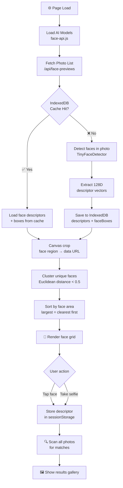

<<<<<<< HEAD
<div align="center">


<br/>

[](https://nextjs.org/)
[](https://github.com/justadudewhohacks/face-api.js)
[](https://www.typescriptlang.org/)
[](https://tailwindcss.com/)
[](LICENSE)
[](https://github.com/kevinmathew47/find-your-photo/pulls)

<br/>

> **✨ Snap a selfie. Find every photo of you. Instantly. Privately.**  
> No servers. No uploads. No data ever leaves your device.

<br/>

---

</div>

## 🌟 What is Find Your Photo?

**Find Your Photo** is a blazing-fast, privacy-first AI photo finder built for events, parties, college fests, and corporate gatherings. Give it a selfie (or just tap your face from the gallery preview), and it instantly scans the entire event photo collection to find **every single photo you appear in** — all using cutting-edge face recognition that runs 100% in your browser.

<div align="center">

```
📸 Selfie  →  🧠 AI Face Match  →  🖼️ Your Photos Found
```

</div>

---

## ✨ Features

<table>
<tr>
<td width="50%">

### 🎯 Smart Face Recognition
- Powered by **face-api.js** (TensorFlow.js)
- Detects & encodes faces with **128-point descriptors**
- Handles multiple faces in group photos
- Works on selfies, candid shots, and side profiles

</td>
<td width="50%">

### ⚡ Lightning Performance
- **Batch processing** (12 photos at a time)
- **IndexedDB caching** — second visit is instant
- TinyFaceDetector as primary (fast + accurate)
- Sorted by face size — clearest faces shown first

</td>
</tr>
<tr>
<td width="50%">

### 🔒 100% Private
- All AI runs **entirely in your browser**
- Zero data sent to any server
- No login, no accounts, no tracking
- Your photos never leave your device

</td>
<td width="50%">

### 🎨 Premium UI/UX
- Dark glassmorphism design
- Animated particle background
- Circular face avatar grid with canvas crops
- Smooth micro-animations & hover effects

</td>
</tr>
</table>

---

## 🚀 Demo

<div align="center">

| Step 1 — Browse Faces | Step 2 — Tap Your Face | Step 3 — See Results |
|:---:|:---:|:---:|
| 🔍 AI scans gallery | 👤 Tap your circle | 🖼️ All your photos! |

</div>

**Two ways to search:**

1. 📷 **Take a Selfie** — Use your camera for a live selfie match
2. 👆 **Tap Your Face** — Click on your face in the gallery preview grid

---

## 🛠️ Tech Stack

<div align="center">

| Layer | Technology |
|---|---|
| 🖼️ Framework | [Next.js 14](https://nextjs.org/) (App Router) |
| 🧠 Face AI | [face-api.js](https://github.com/justadudewhohacks/face-api.js) |
| 💅 Styling | [TailwindCSS](https://tailwindcss.com/) + Vanilla CSS |
| 🗄️ Cache | Browser IndexedDB (v4 schema) |
| 🎨 Canvas | HTML5 Canvas API (face crop rendering) |
| 📦 Language | TypeScript 5 |
| 🚀 Runtime | Node.js + Edge-compatible APIs |

</div>

---

## 📦 Getting Started

### Prerequisites

- Node.js `>= 18`
- npm or yarn

### Installation

```bash
# 1. Clone the repository
git clone https://github.com/kevinmathew47/find-your-photo.git
cd find-your-photo

# 2. Install dependencies
npm install

# 3. Add your event photos
# Drop all photos into the public/photos/ folder
mkdir -p public/photos
# (copy your .jpg / .jpeg / .png / .webp files here)

# 4. Start the development server
npm run dev
```

Open [http://localhost:3000](http://localhost:3000) in your browser 🎉

### Production Build

```bash
npm run build
npm start
```

---

## 📁 Project Structure

```
find-your-photo/
├── app/
│   ├── page.tsx              # 🏠 Landing page + Face grid + AI scan
│   ├── camera/               # 📷 Selfie camera interface
│   ├── results/              # 🖼️ Matched photos gallery
│   ├── globals.css           # 🎨 Global styles & animations
│   └── api/
│       ├── face-previews/    # 📋 Sampled photo list for scanning
│       ├── list-photos/      # 📷 Full photo directory listing
│       ├── match/            # 🧠 Face match endpoint
│       └── scan-photos/      # 🔍 Photo scan controller
├── public/
│   ├── models/               # 🤖 face-api.js AI model files
│   └── photos/               # 📸 Your event photos go here!
└── lib/                      # 🛠️ Utility functions
```

---

## ⚙️ How It Works



---

## 🎛️ Configuration

### Adjusting Match Sensitivity

In `app/page.tsx`, find:
```ts
const CLUSTER_THRESHOLD = 0.5;
```
- **Lower** (e.g. `0.4`) → more strict matching (fewer false positives)
- **Higher** (e.g. `0.6`) → more relaxed (catches more photos, may include near-matches)

### Changing Photo Sample Size

In `app/api/face-previews/route.ts`:
```ts
const MAX = 120; // Increase for larger galleries
```

### Face Crop Padding

In `app/page.tsx`, `buildCropDataUrl`:
```ts
const PAD = 0.55; // 55% padding around detected face box
```

---

## 🤝 Contributing

Contributions, issues and feature requests are welcome! 🎉

```bash
# Fork the repo, then:
git checkout -b feature/amazing-feature
git commit -m 'feat: add amazing feature'
git push origin feature/amazing-feature
# Open a Pull Request!
```

---

## 🗺️ Roadmap

- [ ] 🎭 Expression-aware matching
- [ ] 📱 PWA / installable app
- [ ] 🖼️ Bulk photo download (zip)
- [ ] 🌐 Multi-language support
- [ ] 🎬 Video frame scanning
- [ ] 📊 Admin dashboard for event organizers

---

## 📄 License

This project is licensed under the **MIT License** — see the [LICENSE](LICENSE) file for details.

---

<div align="center">

**Made with ❤️ by [Kevin Mathew](https://github.com/kevinmathew47)**

<br/>

⭐ **Star this repo** if you found it useful!

<br/>

[](https://github.com/kevinmathew47/find-your-photo/stargazers)
[](https://github.com/kevinmathew47/find-your-photo/network)

<br/>

*Find Your Photo — Because every moment deserves to be found.* 🌟

</div>
=======
# find-your-photo
>>>>>>> a9b5bb54962202d2534ab3ecaef73833f4f68e73
